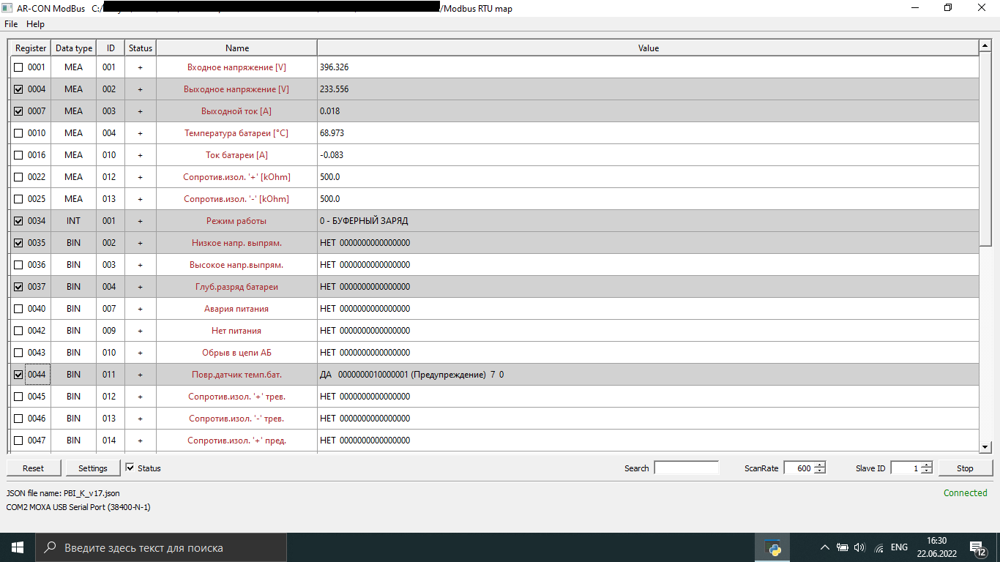
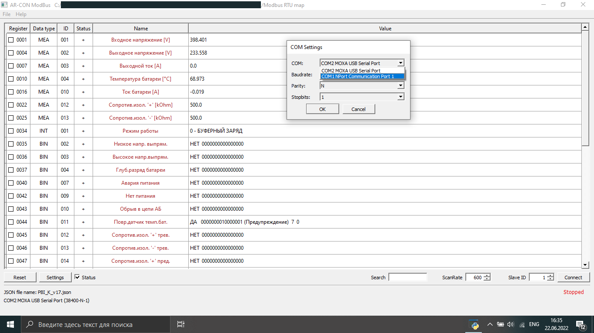
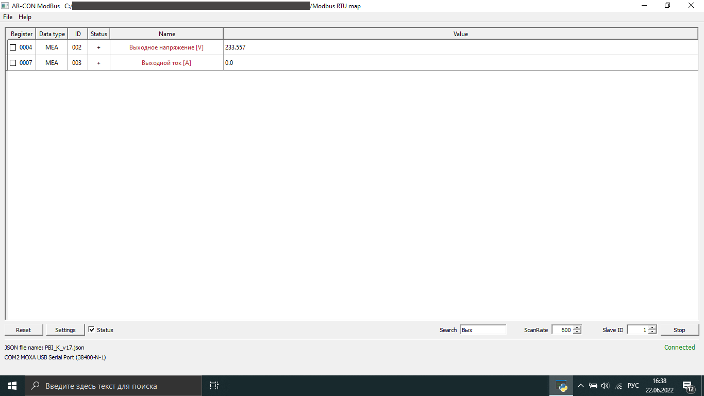

# modbusser
This app developed for simplify work with modbus.
Main funtion this program is importing ModBus map in txt format
and reading data from slave device with registers in the map.

Some functions:

1. Selecting need rows and save them

2. Communication settings

3. Searching rows

